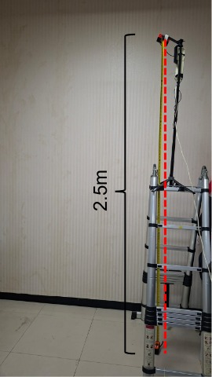
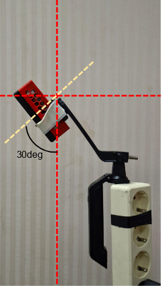
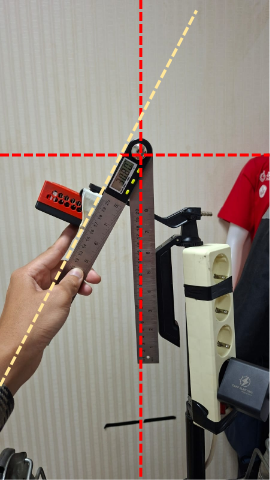
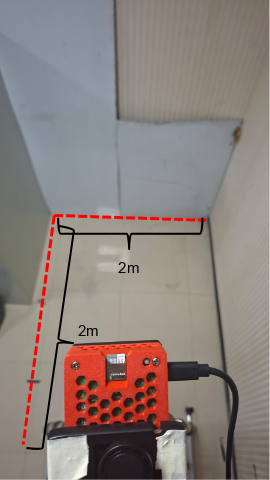

# Skenario Uji : Pengambilan Data Baseline ToF (36 Klip)

**Status:** 
Draft uji baseline data , belum dataset fix

**Cakupan set ini:** 
- 9 aktivitas baseline (N1–N8b) × 2 partisipan × 2 repetisi = **36 klip** (24 jatuh, 12 non-jatuh).

**Yang bisa dibuktikan set ini:** 
- pipeline **akuisisi → rekam → ekstraksi berjalan**
- base classifier masuk akal pada data bersih
- kualitas observasi `Q(x)` tinggi pada kondisi baseline.

**Yang TIDAK bisa dibuktikan:** 
- Hard Negative (HN) dan Observation Limits (OL) , untuk membuktikan dapat membedakan jatuh dan jongkok/duduk dan menunda pendeteksian ketika gambar terpotong.

---
## 1. Setup

### 1.1 Hardware

| Item           | Spesifikasi / catatan                                                                                                                                                                                 |
| -------------- | ----------------------------------------------------------------------------------------------------------------------------------------------------------------------------------------------------- |
| Sensor         | Arducam ToF (240×180, FOV 70° diagonal, mode 2 m / 4 m). **Default mode 4 m**                                                                                                                         |
| Komputer       | Raspberry Pi 5 4 GB, Ubuntu 24.04, ROS 2 Jazzy                                                                                                                                                        |
| Tinggi / sudut | - Tinggi ±2,5 m (tinggi plafon kamar mandi representatif perlu diukur). <br>- Pitch awal 60° dari horizontal (= 30° dari vertikal)<br>- Square Floor (2x2m) : **belum di test grid untuk yg rebahan** |
| Alat ukur      | meteran dan penggaris sudut                                                                                                                                                                           |
| Properti       | Matras (area jatuh), kursi (N3), penanda posisi mulai partisipan (lakban)                                                                                                                             |

### 1.2 ROS (di Pi)

| Item              | Detail                                                                                                                                                                                                                                                                                                                                                                                                                                                                                             |
| ----------------- | -------------------------------------------------------------------------------------------------------------------------------------------------------------------------------------------------------------------------------------------------------------------------------------------------------------------------------------------------------------------------------------------------------------------------------------------------------------------------------------------------- |
| Driver            | Package bawaan Arducam: `arducam_rclpy_tof_pointcloud` (node `tof_pointcloud`), dibuild dari `Arducam_tof_camera/ros2_publisher` dengan `colcon build --merge-install` (sesuai wiki resmi Arducam). Tidak ada package akuisisi baru                                                                                                                                                                                                                                                                |
| Topik direkam     | **Tersedia (dikonfirmasi): PointCloud2 dan depth Image.** Amplitude tidak tersedia; `camera_info` belum dicek. Data utama = depth Image (ringan). PointCloud2 (`REC_CLOUD`) lebih berat (ukuran/fps diukur di uji teknis), tapi **tidak otomatis opsional**: fitur tinggi tubuh butuh koordinat 3D, dari cloud, atau dari depth + `camera_info` (cek di uji teknis), atau intrinsik pendekatan dari FOV spek. Lihat `tof_tools/PLAN_OVERVIEW.md` Blok 1. Nama topik diisi di `tof_tools/config.sh` |
| Format bag        | MCAP (`-s mcap`), **1 bag per klip**                                                                                                                                                                                                                                                                                                                                                                                                                                                               |
| QoS               | Cek QoS publisher; bila best-effort/sensor_data, pastikan `ros2 bag record` menerima (override QoS bila perlu) *(belum diuji)*                                                                                                                                                                                                                                                                                                                                                                     |
| Prosedur<br>Rekam | Saat merekam: **hanya driver + `ros2 bag record`**. monitoring dilakukan melalu device ROS lain dengan **ROS_DOMAIN_ID=7**                                                                                                                                                                                                                                                                                                                                                                         |
| Jam               | `rec_clip.sh` dijalankan **di Pi yang sama** dengan rekaman, sehingga `t_cue` dan timestamp bag memakai jam yang sama                                                                                                                                                                                                                                                                                                                                                                              |

Skrip rekam dan urutan perintah lengkap: lihat **Bagian 8**.

### 1.3 Host PC

| Item | Detail |
|---|---|
| OS / tool | Ubuntu + ROS 2 Jazzy (atau Python `rosbags`) untuk ekstraksi; Foxglove untuk melihat klip |
| Koneksi | PC dan Pi di jaringan yang sama (SSH untuk menjalankan skrip; `foxglove_bridge` hanya untuk preview *sebelum* loop rekaman) |
| Fungsi | Preview posisi partisipan, cek bag setelah rekam, ekstraksi mcap → npy |
| Backup | Salin `bags/` ke PC/drive kedua **setelah setiap sesi**, bukan di akhir semua sesi |

### 1.4 Lingkungan (dikunci)

- Ruang, posisi tripod, posisi matras, penanda lantai: tidak berubah antar sesi, atau perubahan dicatat di `sessions.csv`.
- Cahaya sekitar: ToF memakai IR 940 nm, jadi sinar matahari langsung berpotensi mengganggu *(hipotesis, belum diuji)*. Tutup jendela / rekam pada jam serupa, catat kondisi.
- Hanya partisipan di dalam frame. Operator/spotter di luar bidang pandang.
- illustrasi pemasangan kamera :
<table>
  <tr>
    <td></td>
    <td></td>
    <td></td>
    <td></td>
  </tr>
</table>

---

## 2. Cara Pengambilan Data

### 2.1 Partisipan

| Aspek                | Ketentuan                                                                                                                                                        |
| -------------------- | ---------------------------------------------------------------------------------------------------------------------------------------------------------------- |
| Jumlah               | 2 orang (keterbatasan, lihat Bagian 7)                                                                                                                           |
| Catat per partisipan | - Tinggi badan<br>- pakaian (warna/bahan). Pakaian gelap menyerap IR dan dapat memengaruhi amplitudo *(hipotesis)*, jadi pakaian dijaga sama dalam satu sesi     |
| Keselamatan          | Matras tebal dan menutup area mendarat, area bebas benda keras, pemanasan, spotter, boleh berhenti kapan saja. Jeda istirahat ≥ 30–60 dtk antar jatuh *(usulan)* |
| Peran minimum        | 1 partisipan + 1 operator/spotter (ideal 3 orang)                                                                                                                |

### 2.2 Daftar klip (slot)

| Kode | Aksi | Arg durasi aksi (dtk) | Total rekam (2+5+aksi+5) |
|---|---|---|---|
| N1 | Berdiri diam | 5 | 17 dtk |
| N2 | Jalan silang frame | 5 | 17 dtk |
| N3 | Duduk normal (tahan) | 3 | 15 dtk |
| N4 | Jatuh depan, cepat | 1 | 13 dtk |
| N5 | Jatuh depan, pelan | 3 | 15 dtk |
| N6 | Jatuh belakang, cepat | 1 | 13 dtk |
| N7 | Jatuh belakang, pelan | 3 | 15 dtk |
| N8a | Jatuh samping, cepat | 1 | 13 dtk |
| N8b | Jatuh samping, pelan | 3 | 15 dtk |

Definisi cepat/pelan : 
- cepat = awal jatuh sampai menyentuh matras ≤ 1 dtk
- pelan = 1,5–3,5 dtk (simulasi lemas/pingsan).

**Arah jatuh** : selalu menjauhi atau menyamping dari kamera agar mendarat di lantai yang tercakup.
- Depan: partisipan membelakangi kamera, jatuh ke depan.
- Belakang: partisipan menghadap kamera, jatuh ke belakang.
- Samping: membelakangi kamera, jatuh ke kanan / kiri.

Posisi awal partisipan: titik yang sudah dicek kepala dan kaki terlihat (Bagian 2.5).

### 2.3 Urutan sesi

1. **Persiapan ruang (sekali, sebelum sesi pertama):** ukur kamar mandi representatif dan tentukan titik pasang serta orientasi kamera (Bagian 2.5).
2. **Setup (tiap sesi):** pasang tripod, ukur tinggi lensa→lantai, nyalakan driver, cek `ros2 topic hz`, resolusi (harus 180×240), encoding depth.
3. **Tes grid** (Bagian 2.5): sekali per konfigurasi kamera; ulangi bila tinggi, pitch, orientasi, atau titik pasang berubah.
4. **Klip `REF`:** tanpa orang, matras dan properti di posisi final, ±10 dtk. Dipakai untuk peta lantai per-pixel dan fit bidang lantai (tinggi + pitch terukur).
5. **Latihan:** partisipan mencoba tiap gerakan 1–2× tanpa rekaman (atau rekam sebagai `_warmup`, tidak dihitung).
6. **Rep 1:** N1 → N8b (dari ringan ke berat).
7. Istirahat.
8. **Rep 2:** N1 → N8b lagi. Urutan diatur operator; urutan klip tidak diseimbangkan, sebutkan di keterbatasan.
9. Backup bag + isi log sesi.

Perkiraan waktu: ±1 menit per klip termasuk reset, jadi ±40–60 menit per partisipan ditambah setup, REF, dan istirahat *(kasar)*.

### 2.4 Prosedur per klip

1. Partisipan di posisi awal, diam.
2. Operator: `./rec_clip.sh P1_R1_N4 1`
3. Partisipan tetap **diam selama pre-buffer** (±5 dtk), mulai aksi hanya setelah aba-aba "GO".
4. Selesai aksi, **tahan posisi akhir** sampai skrip menutup bag (±5 dtk).
5. Operator langsung: `ros2 bag info bags/<nama>` dan cek ringkas (Bagian 3).
6. Valid → lanjut. Tidak valid → beri suffix `_xN` (N = percobaan ke-), catat alasan, ulangi slot yang sama (maks 3 percobaan per slot; bila gagal terus, hentikan dan cari sebabnya).
### 2.5 Area uji dan tes grid 
#### dilakukan sebelum pengujian untuk memastikan validitas data

**Prinsip:** area uji = lantai bebas di kamar mandi representatif ∩ jangkauan kamera. Ukuran persegi 2x2m sebagai acuan standar kamar mandi (belum diuji di lingkungan kamar mandi sesungguhnya).

**Langkah**
1. Ukur ruang: panjang × lebar, tinggi plafon, posisi kloset/shower/pintu.
2. Pilih titik pasang dan orientasi box (landscape/portrait). Pojok atau sisi pintu bisa memberi jarak lebih jauh ke area uji *(hipotesis)*.
3. Lakban grid dengan titik tiap 0,5 m: kolom A, B, C... dari kiri ke kanan; baris 1, 2, 3... dari dekat ke jauh. Baris 1 = 0,5 m di depan dasar kamera, garis tengah segaris dengan dasar kamera. Batasi pada lantai bebas dan jangkauan kamera. Hitungan teoretis pada 60° / 2,5 m: maju sampai ±2,5 m, lebar ±1,3 m (dekat) sampai ±1,9 m (di 2,5 m); mengasumsikan batas 4 m = jarak miring, **belum diverifikasi**.
4. Partisipan (tinggi badan dicatat) berdiri menghadap kamera di tiap titik ±5 dtk, sementara lo melihat live di RViz/Foxglove. Catat per titik: kepala terlihat? kaki terlihat?
5. Kelas per titik: **UTUH** (kepala dan kaki terlihat), **BAWAH** (kaki/pinggul saja), **KELUAR** (tidak atau hampir tidak terlihat).

**Dipakai untuk:**
- Klip N (berdiri dan awal jatuh) hanya mulai dari titik UTUH.
- Jatuh mendarat di titik yang masih terlihat (tubuh rebah boleh di titik BAWAH).
- OL1 (tubuh terpotong) sengaja memakai titik BAWAH atau tepi.
- Setiap klip mencatat `start_node` dan `end_node`.

---

## 3. Kriteria Data Valid (Done) dan Tidak Valid

### 3.1 Set 36 klip dinyatakan DONE bila

- [ ] Seluruh grid 9 × 2 × 2 terisi klip valid (36/36).
- [ ] Setiap sesi memiliki `REF`, tinggi, pitch terukur, dan parameter driver tercatat.
- [ ] `clips.csv` kolom `valid` terisi untuk 36 klip.
- [ ] Backup kedua ada dan terverifikasi (checksum atau ukuran cocok).

Selain itu → **belum done**.

---

## 4. Skema Dataset

### 4.1 Struktur folder

```
dataset_tof_fall/
├── raw/                    # mcap mentah, TIDAK diubah
│   ├── S1_REF/
│   └── P1_R1_N4/ ...
├── clips/                  # hasil ekstraksi; 1 folder = 1 klip
│   └── P1_R1_N4/
│       ├── depth.npy       # (T,180,240) uint16, mm, 0 = invalid
│       ├── meta.json       # n_frames, fps_est, encoding
│       ├── cloud_xyz_firstN.npy  # opsional, N frame cloud pertama (klip REF)
│       └── t.npy           # (T,) int64, ns (log time bag)
├── ref/
│   └── S1_floor_ref.npy    # (180,240) median depth lantai dari klip REF
├── sessions.csv
├── clips.csv
├── frames.csv              # turunan
└── splits.csv
```

`raw/` adalah sumber kebenaran; `clips/` dapat dibuat ulang dari `raw/`.

### 4.2 Format array

`uint16` dalam mm (bukan float32): error sensor ±2 cm, float tidak menambah informasi dan menggandakan ukuran. **Cek encoding driver dulu** (32FC1 dalam meter vs 16UC1 dalam mm) sebelum menulis skrip ekstraksi.

### 4.3 Tabel metadata

**sessions.csv** — 1 baris per sesi
`session_id, date, participant, participant_height_cm, clothing, bathroom_L_m, bathroom_W_m, ceiling_m, camera_position, camera_orientation, camera_height_m, pitch_deg, pitch_method, mat_layout, ambient_light, driver_params, grid_test_ref, ref_clip_id, notes`

**clips.csv** — 1 baris per klip
`clip_id, session_id, participant, rep, code, group, label, fall_type, speed, direction, start_node, end_node, t_cue_s, t_onset_s, t_end_s, n_frames, fps_est, valid, invalid_reason, notes`

- `group` = N / HN / OL; `label` = fall / no_fall.
- `pitch_deg` = sudut sumbu optik di bawah garis horizontal (0° = menghadap lurus ke depan, 90° = menghadap lurus ke bawah).
- `t_onset_s` kosong untuk non-jatuh.

**frames.csv** — turunan, 1 baris per frame
`clip_id, frame_idx, t_s, phase, valid_ratio, edge_touch, continuity, Q, P_fall`
`phase` = pre / action / post, dihitung dari `t_onset_s` dan `t_end_s`.

**splits.csv**
`clip_id, split_group, split, fold` — `split_group` = partisipan. Aturan split (opsi A/B/C untuk 2 partisipan) belum diputuskan; skema ini tidak mengunci itu.

### 4.4 Alur data

`raw/*.mcap` → ekstraksi → `clips/` → hitung `Q` dan `P(fall|x)` → `frames.csv` → evaluasi Sistem A/B/C.

Bedanya dengan dataset Elna (folder gambar per kelas, tanpa info klip/partisipan): setiap frame di sini terlacak ke klip dan partisipan, sehingga frame bertetangga dari klip yang sama tidak bisa tersebar ke train dan test sekaligus.

---
## 5. Hasil yang Diharapkan dari Set Ini

- Pipeline terbukti: rekam → validasi → ekstraksi.
- Estimasi fps efektif dan ukuran data riil di Pi 5.
- Distribusi `Q(x)` pada kondisi bersih (batas bawah untuk menentukan `tau_q` nanti).
- Gambaran awal base classifier pada 24 klip jatuh vs 12 non-jatuh. Dengan n sekecil ini hasilnya **bersifat kelayakan, bukan klaim performa** (interval kepercayaan lebar).

---

## 6. Next Action (berurutan)

| #   | Aksi                                                                                                                                                                          | Output                                                  |
| --- | ----------------------------------------------------------------------------------------------------------------------------------------------------------------------------- | ------------------------------------------------------- |
| 1   | Jalankan `check_topics.sh`: topik sudah dikonfirmasi (PointCloud2 + depth Image); tinggal encoding, fps, bandwidth, `camera_info`                                             | `config.sh` terisi                                      |
| 2   | **Uji teknis `rec_clip.sh`** (klip dummy): `timeout` + SIGINT menutup bag bersih, `ros2 bag info` terbaca `validate_clip.sh`, ukuran/klip, fps efektif (cloud vs tanpa cloud) | Skrip final + angka fps/ukuran                          |
| 3   | Ukur kamar mandi representatif, tentukan titik pasang dan orientasi kamera                                                                                                    | Dimensi ruang + posisi kamera                           |
| 4   | **Tes grid** (Bagian 2.5) + ukur tinggi, fit pitch dari `REF`                                                                                                                 | Peta UTUH/BAWAH/KELUAR + `camera_height_m`, `pitch_deg` |
| 5   | Kunci arah jatuh, definisi cepat/pelan                                                                                                                                        | Dokumen protokol final                                  |
| 6   | Siapkan consent partisipan dan cek kebutuhan etik kampus                                                                                                                      | Consent tertandatangani                                 |
| 7   | **Ambil 36 klip** sesuai Bagian 2, validasi tiap klip (Bagian 3)                                                                                                              | Grid 36/36                                              |
| 8   | Ekstraksi dengan `extract_clips.py` (sudah ada, diuji dengan bag sintetis; jalankan pada data asli)                                                                           | `clips/` terisi                                         |
| 9   | Hitung `Q(x)` (dengan peta lantai per-pixel dari `REF`) pada klip baseline; periksa distribusi                                                                                | Ringkasan `Q` baseline                                  |
| 10  | Rancang set kedua: HN1–HN5 dan OL1–OL4 (set yang menguji klaim inti)                                                                                                          | Draf protokol set 2                                     |

**Catatan implementasi `Q(x)`:** `floor_depth_ref` harus berupa **peta per-pixel** (bukan skalar, karena kamera miring), margin segmentasi tubuh dari matras awalnya ±5–8 cm bukan 15 cm, lalu dituning.

---

## 7. Keputusan Terbuka dan Keterbatasan

| Item                                                                                             | Status                                   |
| ------------------------------------------------------------------------------------------------ | ---------------------------------------- |
| Ambang valid (Bagian 3)                                                                          | Usulan, dikalibrasi di uji teknis        |
| Arsitektur base classifier                                                                       | Belum dikunci                            |
| tes grid untuk posisi kamera (60deg , LxWxH : 2.5x2x2)                                           | tes tidur terpotong atau tidak di kamera |

---

## 8. Urutan Perintah dan File Pendukung — *skrip bash belum diuji di Pi*

Semua file ada di folder **`tof_tools/`** (lihat `tof_tools/README_PENGGUNAAN.md` untuk penjelasan tiap file). **Tidak ada package ROS baru**: akuisisi memakai driver Arducam (`arducam_rclpy_tof_pointcloud`), rekam memakai `ros2 bag`, dan sisanya skrip bash. Instalasi tambahan hanya bila perlu: plugin MCAP (`ros-jazzy-rosbag2-storage-mcap`) dan `pip install mcap mcap-ros2-support numpy` untuk ekstraksi.

| File               | Fungsi                                                            |
| ------------------ | ----------------------------------------------------------------- |
| `config.sh`        | Topik, FPS, buffer, folder data (edit sekali)                     |
| `check_topics.sh`  | Cek topik, QoS, encoding, hz, bw                                  |
| `rec_clip.sh`      | Rekam 1 klip dengan aba-aba GO dan `cue_log.csv`                  |
| `validate_clip.sh` | Cek otomatis durasi dan jumlah pesan                              |
| `run_rep.sh`       | Loop 9 klip N1..N8b per partisipan per rep, dengan ulang otomatis |
| `extract_clips.py` | Bag MCAP → `depth.npy`, `t.npy`, `meta.json`, peta lantai REF     |
| `templates/*.csv`  | `clips.csv` (36 baris terisi sebagian) dan `sessions.csv`         |

**Urutan perintah (di Pi, kecuali dinyatakan lain)**
```bash
# 0. Salin paket ke Pi (dari PC), lalu:
cd ~/tof_tools && chmod +x *.sh

# 1. Terminal 1: driver (biarkan hidup)
source /opt/ros/jazzy/setup.bash
source ~/Arducam_tof_camera/ros2_publisher/install/setup.bash
ros2 run arducam_rclpy_tof_pointcloud tof_pointcloud

# 2. Terminal 2: cek topik, lalu isi config.sh (TOPIC_DEPTH, TOPIC_CLOUD, FPS_NOMINAL)
./check_topics.sh
nano config.sh

# 3. Uji teknis (ulangi 2-3x; coba REC_CLOUD=0 dan 1), hapus bags/TEST_* sesudahnya
./rec_clip.sh TEST_1 3
./validate_clip.sh TEST_1 3

# 3b. Sebelum rekam sungguhan: ukur ruangan + tes grid (Bagian 2.5), tanpa skrip

# 4. Per sesi: klip REF (tanpa orang)
./rec_clip.sh P1S1_REF 0

# 5. Per rep: 9 klip (N1 -> N8b)
./run_rep.sh P1 1
./run_rep.sh P1 2

# 6. Akhir sesi: backup ke PC
rsync -av ~/tof_data/ <user>@<ip_pc>:/path/backup_tof/

# 7. Di PC: ekstraksi
python3 extract_clips.py --bags <backup>/bags --out <dataset> \
    --depth-topic <TOPIK_DEPTH> --cloud-topic <TOPIK_CLOUD> --cloud-first 30
```

**Status verifikasi:** `extract_clips.py` sudah lolos uji dengan bag MCAP sintetis (Image 16UC1/32FC1 dan PointCloud2 terorganisir). Skrip bash baru dicek sintaksnya; perilaku `timeout` + SIGINT dengan `ros2 bag record` dan format `ros2 bag info` di Jazzy lo harus dibuktikan di langkah 3.
